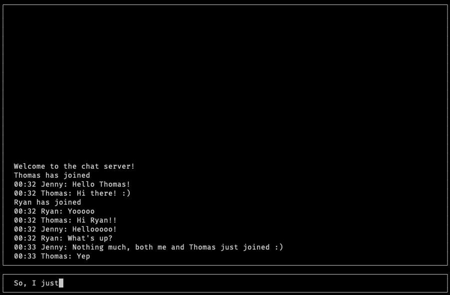

# SmolChat

A very small chat application made with Linux sockets for communication &
ncurses for drawing UI.

The goal is to practice sending/receiving information through sockets,
a bit of multithreading, learning ncurses and handling signals.

Also, I haven't written a lot of C++ code so I wanted to get familiar with
a couple of the stuff it has to offer. Still, I'd say that most of the code is
fairly C-like.

I have split the chat application into two major parts, the server and the client.

## Compiling

```bash
dirivial:~$ git clone https://github.com/dirivial/SmolChat
dirivial:~$ cd SmolChat/
dirivial:~/SmolChat$ make
dirivial:~/SmolChat$ ./SmolClient -u jeff -i 127.0.0.1:8080
```

!Note: At least for now you need to specify a port number
!!Note: The server is compiled to 'SmolServer' and requires you to
put a port number, say 8080.


